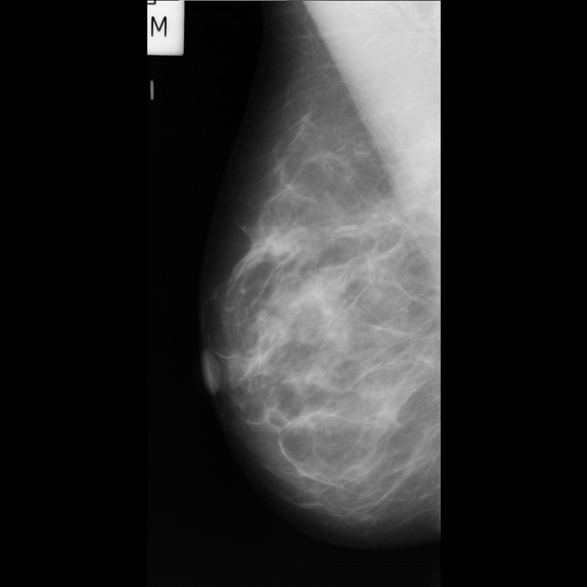
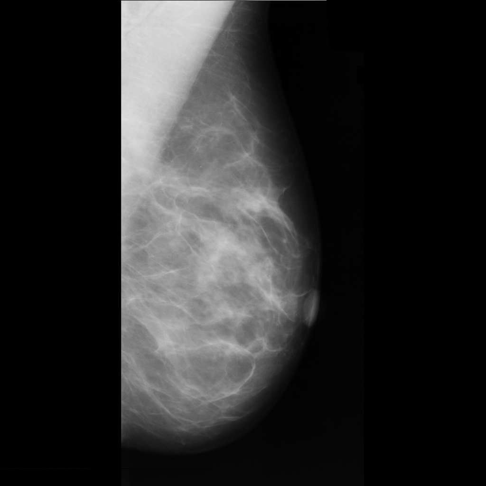

# Image denoising on the MIAS mammography dataset

This project was developed as part of the Multimedia course, taught by Prof. Dario Allegra and Prof. Filippo Stanco as part of the Master's Degree in Computer Science at University of Catania.

The goal of this project is to build an image processing pipeline to remove artifacts, such as block of texts, in a set of mammography images.
This data pre-processing pipeline can be seen as a way to prepare data for classification tasks.
The dataset used is the "Mias Mammography" dataset available at the following link: https://www.kaggle.com/datasets/kmader/mias-mammography, with **license described below.**
The images are not included in this repo and should be download apart from the link above.

The constructed pipeline consists of:
- flipping some image for compliance
- removal of white text blocks;
- removal of large white stripes;
- removal of small white regions, such as circles and small stripes;

The pipeline is fully described in the following report: **docs/raffaele_terracino_multimedia_project_report.pdf**.

An example is the following:

| Input | Output |
|-------|------|
|  |  |

Credits to the Mammographic Image Analysis Society ("MIAS").

Acknowledgements/LICENCE
MAMMOGRAPHIC IMAGE ANALYSIS SOCIETY
MiniMammographic Database
LICENCE AGREEMENT
This is a legal agreement between you, the end user and the
Mammographic Image Analysis Society ("MIAS"). Upon installing the
MiniMammographic database (the "DATABASE") on your system you are
agreeing to be bound by the terms of this Agreement.

GRANT OF LICENCE
MIAS grants you the right to use the DATABASE, for research purposes
ONLY. For this purpose, you may edit, format, or otherwise modify the
DATABASE provided that the unmodified portions of the DATABASE included
in a modified work shall remain subject to the terms of this Agreement.
COPYRIGHT
The DATABASE is owned by MIAS and is protected by United Kingdom
copyright laws, international treaty provisions and all other
applicable national laws. Therefore you must treat the DATABASE
like any other copyrighted material. If the DATABASE is used in any
publications then reference must be made to the DATABASE within that
publication.
OTHER RESTRICTIONS
You may not rent, lease or sell the DATABASE.
LIABILITY
To the maximum extent permitted by applicable law, MIAS shall not
be liable for damages, other than death or personal injury,
whatsoever (including without limitation, damages for negligence,
loss of business, profits, business interruption, loss of
business information, or other pecuniary loss) arising out of the
use of or inability to use this DATABASE, even if MIAS has been
advised of the possibility of such damages. In any case, MIAS's
entire liability under this Agreement shall be limited to the
amount actually paid by you or your assignor, as the case may be,
for the DATABASE.
